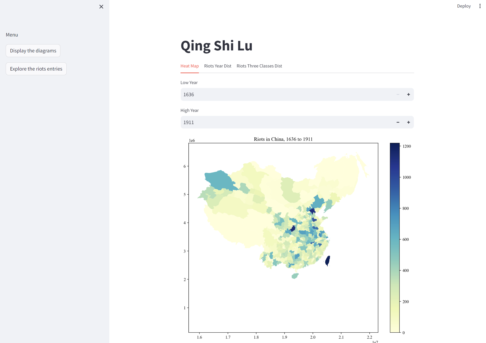

# Machine Learning Methods to Identify Riot Entries from 清实录 (Qing Shi Lu)

## :hugs: Brief Introduction

Feel free to contact <a href="https://senyan1999.github.io/" target="_blank">Sen Yan</a> via his email sen.yan@colorado.edu if you have any questions. 

## :computer: Demo Website

Please visit our [demo website](https://qingshilu-riot-ml-efpftbunv2eumqbikxssat.streamlit.app/).



## :boom: Re-Implementation


### Step 1: Install Python and Related Python Libraries

1. Install Python 
2. Instal Related Python Libraries

    ```bash
    pip install -r requirements.txt
    ```
**Note:** Recommend to run the following program in a machine with NVIDIA-GPU Cards and install [pytorch with GPU support](https://pytorch.org/get-started/locally/). Otherwise it takes a long time for training and inference GUWEN-BERT.  

### Step 2: Extract Time (Year and Month), Prefecture, and Label (Riot vs Non-Riot) From Each Entry

**Input:**  data/entries, data/annotation_chen, data/sixclasses, data/location/1820/\*, data/location/1911/\*

**Output:** data/data.pkl

**Command:**

```bash
python main.py --process_raw_data
```

### Step 3: Prepare the Data for Training Process
**Input:** data/data.pkl

**Output:** data/train.pt, data/test.pt, data/three_classes_train.pt, data/three_classes_test.pt

**Command:**

```bash
python main.py --prepare_data
```

### Step 4: Train GUWEN-BERT (Binary Classifier)

**Input:** data/train.pt, data/test.pt

**Output:** logs/guwen-bert.pt

**Command:**

```bash
python main.py --train
```

### Step 5: Train GUWEN-BERT (Triple Classifier)

**Input:** data/three_classes_train.pt, data/three_classes_test.pt

**Output:** logs/triple-guwen-bert.pt

**Command:**

```bash
python main.py --train_three_classes
```

### Step 6: Apply GUWEN-BERT (Binary Classifier) to All Entries in Qing Shi Lu to Identify Riot-Entries

**Input:** logs/guwen-bert.pt, data/data.pkl

**Output:** data/binary_infer_entries.json

**Command:**

```bash
python main.py --infer
```

### Step 7: Apply GUWEN-BERT (Triple Classifier) to Riot-Entries from Step 6 to Identify Triple Classes

**Input:** logs/triple-guwen-bert.pt, data/binary_infer_entries.json

**Output:** data/triple_infer_entries.json

**Command:**

```bash
python main.py --infer_three_classes
```

### Step 8: Export the Results to Stata Data Format for Future Analysis

**Download the file [`China_pre_post.dta`](https://www.dropbox.com/scl/fi/s62e44kja8zhks67a6p3d/China_pre_post.dta?rlkey=uxv0oj8tq1d7nlsnsoehwfx1f&st=c0wsy3rf&dl=0) and place it in `data/stata/China_pre_post.dta`.**


**Input:** data/triple_infer_entries.json, data/stata/*

**Output:** data/stata/export/*_stata_validation_weather_grain_year.dta

```bash
python main.py --export_data_stata
```

### Option 1: Benchmarking GUWEN-Bert Classifier with Other ML Models
```bash
python main.py --benchmark
```

## :earth\_americas: Run Demo Website

```bash
python main.py --export_data_web_demo
streamlit run streamlit_app.py
```
